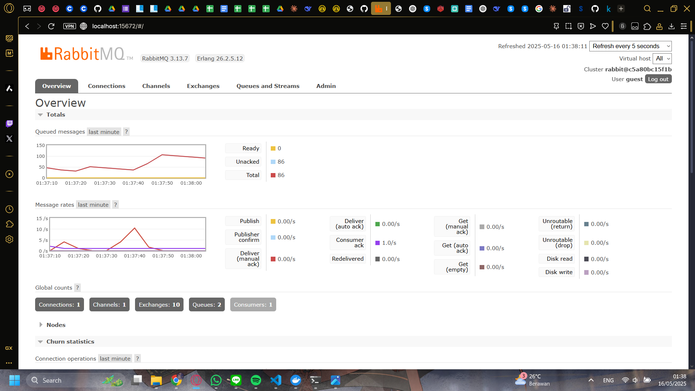

### Questions:

### 1. What is AMQP?

AMQP stands for **Advanced Message Queuing Protocol**. It is a protocol that allows applications to communicate with messaging systems such as RabbitMQ in a standardized way. AMQP defines how messages are sent, stored, and received between producers (publishers) and consumers (subscribers). It enables decoupling of components in a distributed system, so that different parts of an application can communicate without being tightly linked. The protocol supports various messaging patterns including point-to-point, publish-subscribe, and request-response. One of the key benefits of AMQP is reliability—it ensures messages are delivered even when systems crash or go offline temporarily. It also supports message acknowledgments, retries, and message persistence, which are critical in production environments.

### 2. What does guest:guest@localhost:5672 mean?

This string is a **connection URL** used to connect to the RabbitMQ message broker. The first "guest" represents the **username** used for authentication, while the second "guest" is the **password** for that user. These credentials are the default for a RabbitMQ server running in a local development environment. The "localhost" part indicates that the RabbitMQ server is running on the **same machine** as the application. The port number **5672** is the **default AMQP port** that RabbitMQ listens on for incoming connections. This connection string is used by both publishers and subscribers to establish communication with the same message broker, ensuring they operate on the same event queue. It's crucial to note that in production environments, these credentials should be changed to something secure, and the server should not run on localhost unless isolated properly.

## Simulating a Slow Subscriber

In this simulation, I modified the subscriber code to include a 1-second delay (`thread::sleep`) when processing each message. This effectively slows down the consumer so that it cannot keep up with the rate at which the publisher sends events.

After launching the subscriber and running the publisher repeatedly and rapidly (around 20+ times in quick succession), I checked the RabbitMQ management interface. There, I saw a buildup in the message queue, showing **100 messages** pending in the `user_created` queue.

This happens because RabbitMQ acts as a buffer — the publisher can send messages quickly, and RabbitMQ temporarily stores them until the slower subscriber can consume and process each one. Each message takes approximately 1 second to process due to the artificial delay.

The number of messages (100 in my case) reflects how many times I ran the publisher and how fast I did it. Since I was repeatedly executing the publisher very quickly, it sent a high number of events into the queue before the subscriber had a chance to catch up.

This test shows how RabbitMQ efficiently handles load surges by queuing messages for later processing and why such queue monitoring is important for maintaining healthy systems.

